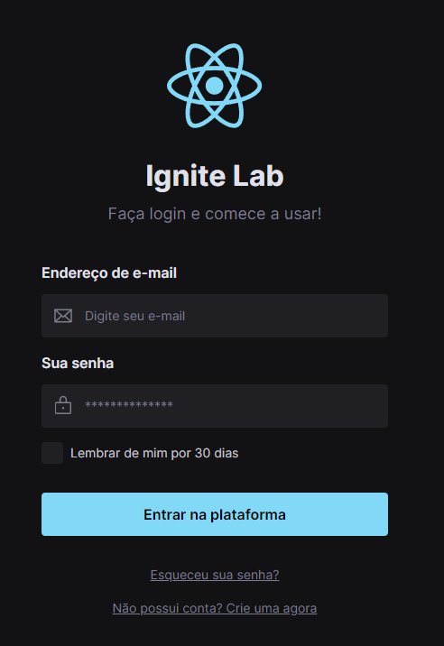

## Ignite Lab - Design System

### Criação de design system e patterns no ReactJS

* Aula 01 - Design System no Figma:
  ### Definição dos tokens e componentes.

[Acesso ao projeto no Figma](https://www.figma.com/file/V5ehqgbeia936AxTdiZB3T/design-system-ignite-lab?node-id=1%3A182)

* Aula 02 - React, Tailwind e Storybook:
  ### Projeto em React e utilizando a criação de documentação com Storybook.

[Acesso ao Storybook](https://mayaragualberto.github.io/design-system-ignite-lab/?path=/story/components-button--default)

* Aula 03 - Aplicação criada:

  

